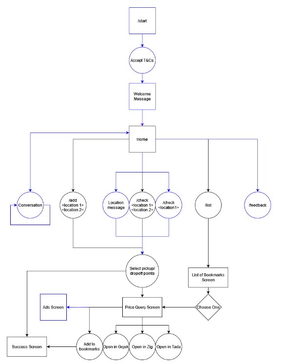
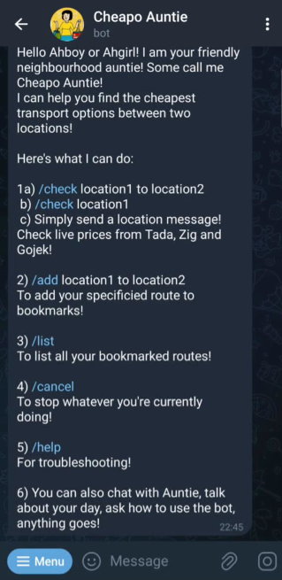
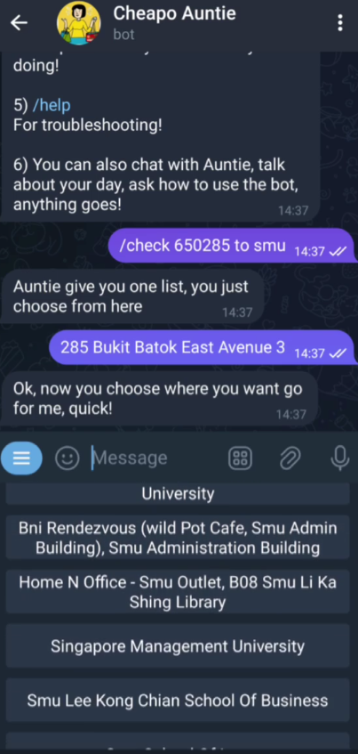
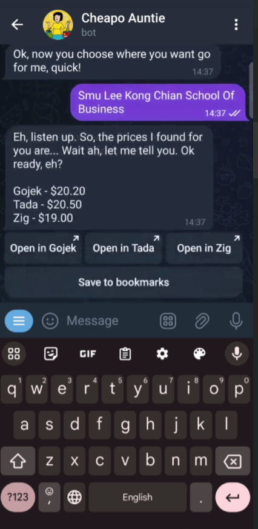
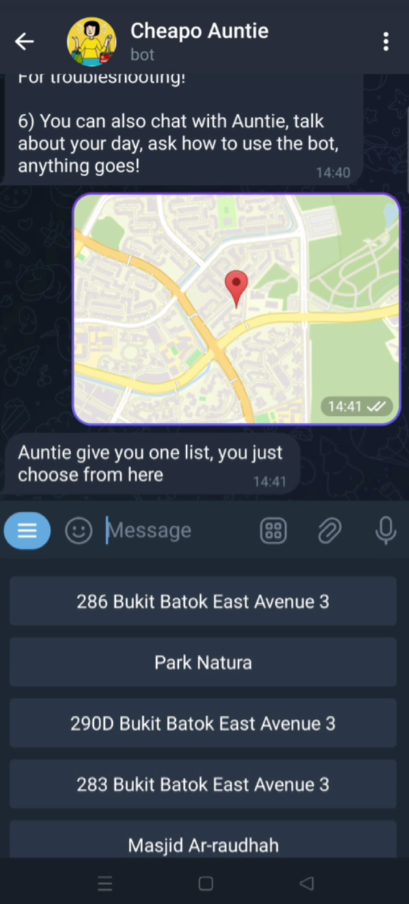
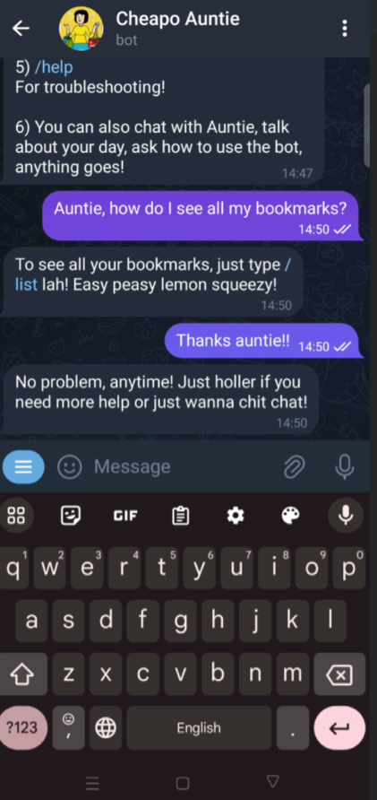
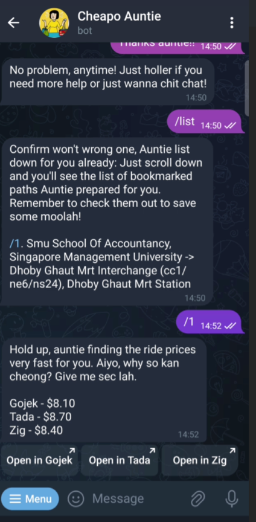

<!-- Improved compatibility of back to top link: See: https://github.com/othneildrew/Best-README-Template/pull/73 -->

<!--
*** Thanks for checking out the Best-README-Template. If you have a suggestion
*** that would make this better, please fork the repo and create a pull request
*** or simply open an issue with the tag "enhancement".
*** Don't forget to give the project a star!
*** Thanks again! Now go create something AMAZING! :D
-->

<!-- PROJECT SHIELDS -->
<!--
*** I'm using markdown "reference style" links for readability.
*** Reference links are enclosed in brackets [ ] instead of parentheses ( ).
*** See the bottom of this document for the declaration of the reference variables
*** for contributors-url, forks-url, etc. This is an optional, concise syntax you may use.
*** https://www.markdownguide.org/basic-syntax/#reference-style-links
-->
<!-- ABOUT THE PROJECT -->
## About The Project

![Product Start][aunty]

The following project is an AI telegram-based chatbot integrated with OpenAI's LLM model, that offers fast and accessible prices to the cheapest ride-hailing prices. It is an attempt to monetize a product through engagement with users on the telegram platform. 

The features we have implemented include
* Location-based search via typing or the pin location feature
* Aunty-like singlish persona for smooth and dynamic conversations  
* Collection of user data for targeted advertising
* Showing customized Ads with a touch of the Aunty personality  
* Bookmarks to save your locations 

(<a href="#readme-top">back to top</a>)

## Notice

**Please Note:** This project is not meant for cloning and setting up locally for individual use. It serves a specific purpose and is intended for reference or contribution purposes only. For any inquiries or collaboration opportunities, please contact the project maintainers.

(<a href="#readme-top">back to top</a>)

<!-- USAGE EXAMPLES -->
## Usage

1. **Workflow**

  

2. **Start and Check**

  

    
    
    
  

3. **Pinning feature, help and bookmarks**
  

    
    
    
  

4. **Ad pipeline**

![Adpipeline][pipeline]

For more information, please refer to the [Presentation](https://www.canva.com/design/DAGBKD09ptI/4sK-y92pr1hmF23wlmU25g/edit?utm_content=DAGBKD09ptI&utm_campaign=designshare&utm_medium=link2&utm_source=sharebutton)

(<a href="#readme-top">back to top</a>)

<!-- MARKDOWN LINKS & IMAGES -->
<!-- https://www.markdownguide.org/basic-syntax/#reference-style-links -->
[product-workflow]: images/workflow.png
[start]: images/start.png
[check]: images/check.png
[prices]: images/prices.png
[location]: images/location.png
[help]: images/help.png
[pipeline]: images/pipeline.png 
[bookmarks]: images/bookmarks.png
[aunty]: images/aunty.png

